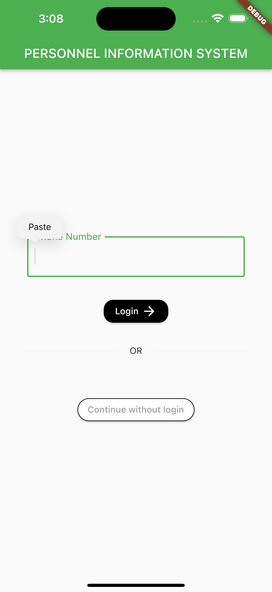
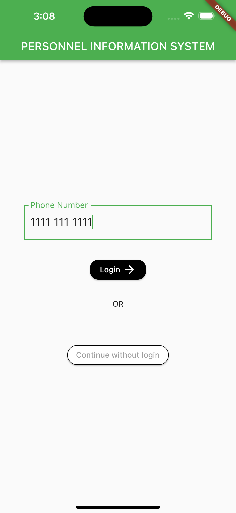
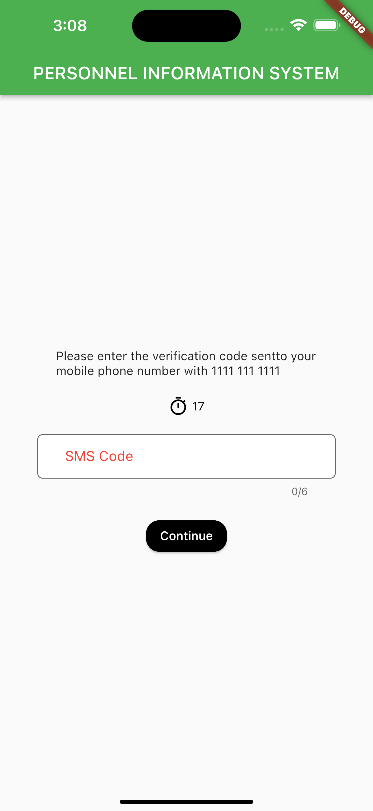
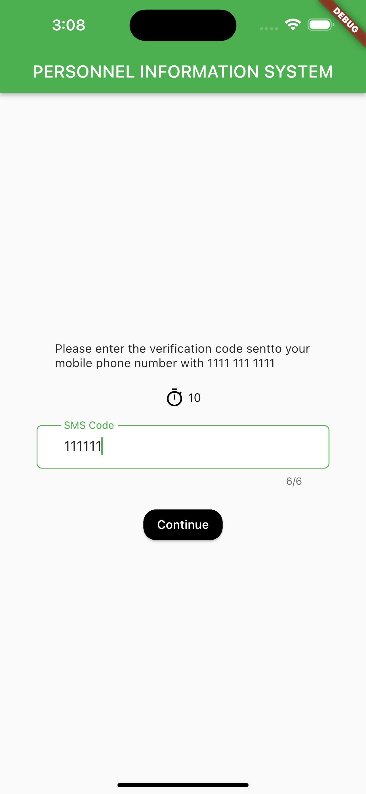
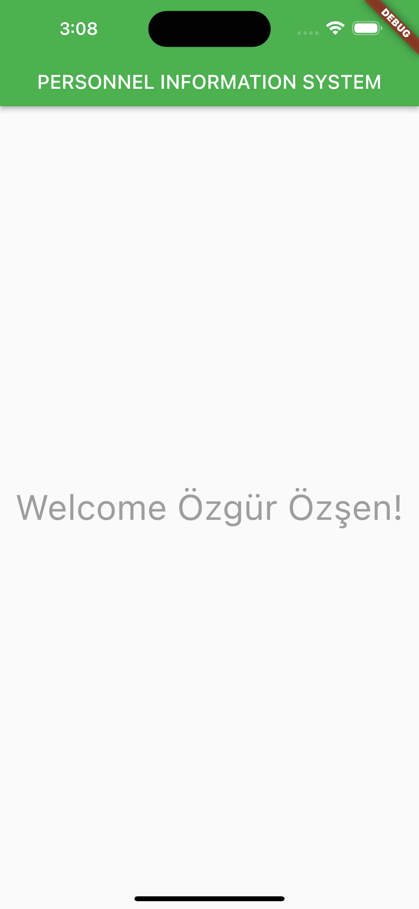

# SIMPLE SMS VERIFICATION

## Getting Started

This project is a homework for the course "Mobile Programming 1" at university. The goal was to create a simple fake SMS verification app using Flutter. The app is not functional, it only has a few screens and a few widgets.

## Screenshots

## Installation

  1. Clone the repository
  2. Open the project in Visual Studio Code
  3. Run the project

## Built With

  - [Flutter](https://flutter.dev/) - The framework used
  - [Visual Studio Code](https://code.visualstudio.com) - The IDE used

## License

This project is licensed under the MIT License - see the [LICENSE.md](LICENSE.md) file for details
